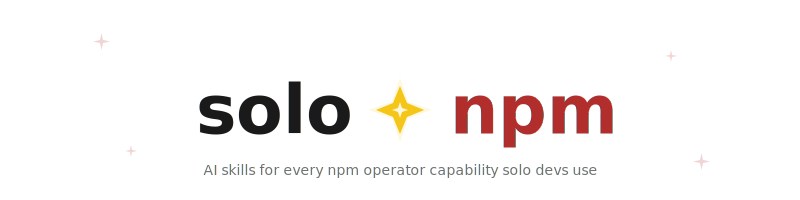
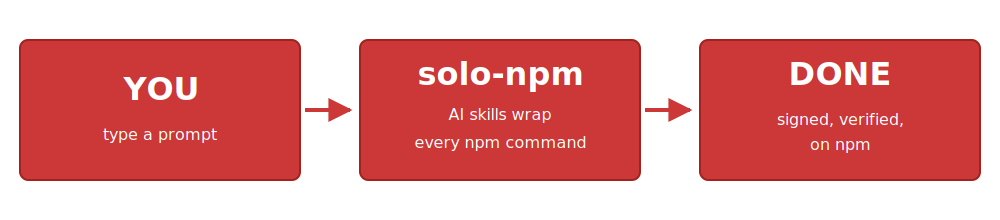

<p align="center">
  
</p>

<p align="center"><b>AI skills for every npm command a solo dev runs — publish, version, dist-tag, deprecate, audit, deps, owner, trust — with verify gates and provenance baked in.</b></p>

<p align="center">
  
</p>

<p align="center">
  
</p>

> ### 🤖 Built to be driven by Claude
>
> **Open Claude Code in your repo, say *"Integrate solo-npm and follow the Quick Start"*, and from then on every release, audit, hotfix, and dep upgrade is one prompt away.** No manual `npm version`, no manual `git tag`, no manual changelog — Claude orchestrates the skills end-to-end.
>
> **For solo devs**, this means:
> - **Daily release**: type *"ship it"* — Claude runs `/verify`, bumps the version from your commits, tags, watches CI, and verifies the registry attestation.
> - **CVE alert**: type *"audit my deps"* — Claude classifies, fixes Tier-1, runs `/verify`, commits the bump.
> - **Hotfix on v1**: type *"fix the v1 rate-limiter, it crashes on 429"* — Claude branches, applies the fix, ships the patch with the right dist-tag.
> - **Morning check**: type *"how are my packages doing"* — Claude renders a portfolio dashboard.
>
> No CLI to memorise. No browser tabs to open. **Just describe what you want.**

---

## Table of contents

- [Why solo-npm?](#why-solo-npm)
- [Commands at a glance](#commands-at-a-glance)
- [npm coverage](#npm-coverage)
- [Tell Claude](#tell-claude)
- [Quick Start](#quick-start)
- [Commands — detail](#commands--detail)
- [Composition with `agent-skills`](#composition-with-agent-skills)
- [Architecture](#architecture)
- [Diagnostic prompts (symptom → skill)](#diagnostic-prompts-symptom--skill)
- [Advanced](#advanced)
- [See also](#see-also)

---

## Why solo-npm?

You're a solo developer — or running a small group of LLM agents — shipping npm packages. PRs are disabled in your repos (issue/discussion contribution model only). There's no committee, no second pair of human eyes.

Existing release tooling is built for teams: PR-based workflows, multi-stage approvals, complex changelog negotiation. In a solo or agent-driven context that overhead becomes friction — and friction makes you skip steps when you're moving fast. Skipped steps make unsigned, unverified, opaque releases.

**solo-npm replaces that friction with one structured `AskUserQuestion` checkpoint per release and silent automation everywhere else.** The skills bake in opinionated defaults — SLSA provenance attestation, OIDC Trusted Publishing, conventional-commit-driven version bumps, verify-gated dep upgrades — so you can't accidentally ship something untested or unsigned.

Beyond the release moment, the operate skills (`/status`, `/audit`, `/deps`) replace the morning ritual of opening five browser tabs to check on your portfolio. One terminal command per concern.

**Tools used under the hood:** [`npm-trust`](https://github.com/gagle/npm-trust) (CLI for OIDC trust config), [`gagle/prepare-dist`](https://github.com/gagle/prepare-dist) (monorepo dist translation, optional).

---

## Commands at a glance

| Phase | Command | One-line purpose |
|---|---|---|
| **Bootstrap** | [`/solo-npm:init`](.claude/commands/init.md) | Scaffold release.yml + publishConfig + .nvmrc + wrappers + cache. Idempotent. |
| **Bootstrap** | [`/solo-npm:trust`](.claude/commands/trust.md) | Configure OIDC Trusted Publishing per package via the `npm-trust` CLI. |
| **Per release** | [`/solo-npm:release`](.claude/commands/release.md) | Universal release entry. Auto-chains to `/prerelease` on pre-release version; offers `/deprecate` after major. |
| **Per release** | [`/solo-npm:verify`](.claude/commands/verify.md) | Lint + typecheck + test + build + pkg-check. Halt on first failure (severity by context). |
| **Lifecycle transition** | [`/solo-npm:prerelease`](.claude/commands/prerelease.md) | Start/bump/promote pre-release lines (alpha/beta/rc → stable). Aggregated changelog on promote. |
| **Lifecycle transition** | [`/solo-npm:hotfix`](.claude/commands/hotfix.md) | Patch a previous stable major. Cherry-pick automation for forward-port and backport. |
| **Operate** | [`/solo-npm:status`](.claude/commands/status.md) | Portfolio dashboard. Multi-channel (`@latest`/`@next`) aware. Surfaces maintenance lines. |
| **Operate** | [`/solo-npm:audit`](.claude/commands/audit.md) | Security audit with 4-tier risk classification. Chains to `/deps` or `/deprecate`. |
| **Operate** | [`/solo-npm:deps`](.claude/commands/deps.md) | Tier-batched dep upgrades with `/verify` gates. |
| **Operate** | [`/solo-npm:dist-tag`](.claude/commands/dist-tag.md) | Manage `npm dist-tag` post-publish — cleanup stale `@next`, repoint `@latest`, channels (`@canary`). |
| **Operate** | [`/solo-npm:deprecate`](.claude/commands/deprecate.md) | Mark versions deprecated (range-aware, mass + reversible). Safer than `npm unpublish`. |
| **Operate** | [`/solo-npm:owner`](.claude/commands/owner.md) | Manage maintainers across packages — bus-factor mitigation, audits, transfer. |
| **Recovery** | [`/solo-npm:unpublish`](.claude/commands/unpublish.md) | Remove or rename published packages with strict safety gates — wrong-name cleanup, rename-redirect. Defaults to deprecate. |

---

## npm coverage

solo-npm wraps the npm commands a solo-dev publisher actually runs. Honest about what's in and what isn't:

| npm command | Skill | Status |
|---|---|---|
| `npm publish` (with provenance + OIDC) | [`/solo-npm:release`](.claude/commands/release.md) | ✓ |
| `npm version` (auto-bump from commits) | [`/solo-npm:release`](.claude/commands/release.md) | ✓ |
| `npm dist-tag` at publish time | release.yml three-layer detection (auto, scaffolded by `/init`) | ✓ |
| `npm dist-tag` post-publish | [`/solo-npm:dist-tag`](.claude/commands/dist-tag.md) | ✓ |
| `npm deprecate` (mass + reversible) | [`/solo-npm:deprecate`](.claude/commands/deprecate.md) | ✓ |
| `npm owner` add/rm/ls | [`/solo-npm:owner`](.claude/commands/owner.md) | ✓ |
| `npm audit` (with risk classification) | [`/solo-npm:audit`](.claude/commands/audit.md) | ✓ |
| `npm audit fix` (chained) | `/solo-npm:audit` → `/solo-npm:deps` | ✓ |
| `npm outdated` + dep upgrades | [`/solo-npm:deps`](.claude/commands/deps.md) | ✓ |
| `npm view` (portfolio dashboard) | [`/solo-npm:status`](.claude/commands/status.md) | ✓ |
| `npm login` + 2FA + OIDC trust config | [`/solo-npm:trust`](.claude/commands/trust.md) | ✓ |
| `package.json` completeness validation | [`/solo-npm:verify`](.claude/commands/verify.md) Step 5: pkg-check | ✓ |
| `npm access` set post-publish | (manual `npm access set`) | non-goal — rare |
| `npm unpublish` (within 72h or post-72h criteria) | [`/solo-npm:unpublish`](.claude/commands/unpublish.md) | ✓ shipped v0.10.0 |
| `npm token` mgmt | (manual `npm token`) | non-goal — OIDC obviates for CI |
| `npm hook`, `npm org`, `npm team` | (manual) | non-goal — not solo-dev |
| `npm sbom` | (manual `npm sbom`) | defer — niche compliance |

As of v0.19.0 the scope is narrowed: solo-npm orchestrates the publish/release lifecycle for TypeScript npm packages. Build-tool choices, daily-dev hygiene, doc generation, and config presets are explicit non-goals — they belong in project-build tooling, not the release wizard.

The release lifecycle also pulls in **gates that aren't npm CLI commands at all**: `/solo-npm:public-api` (public-API surface diff vs last release), `/solo-npm:types` (arethetypeswrong against the packed tarball), `/solo-npm:exports-check` (orphan exports map), `/solo-npm:smoke-test` (tarball pack-install-invoke), `/solo-npm:provenance-verify` (post-publish SLSA attestation check), `/solo-npm:supply-chain` / `/solo-npm:lockfile-audit` / `/solo-npm:secrets-audit` (security gates beyond CVEs), and `/solo-npm:doctor` (5-domain publish-health probe).

> **Heads-up on auth**: `dist-tag`, `deprecate`, and `owner` mutations require a local `npm login` session — OIDC Trusted Publishing only covers `npm publish`. The skills surface a foolproof `npm login` handoff if you're not authenticated locally.

---

## Hardening + stability

solo-npm is **code-side complete** as of v0.19.0 (PART III narrowing — 16 new skills landed). Five major hardening passes shipped between v0.10.1 and v0.13.0 (Tier-1 through Tier-4 strict-safety); the release-gate skill set (`/public-api`, `/types`, `/exports-check`, `/smoke-test`, `/doctor`, supply-chain triad) landed in v0.19.0. What follows are the user-visible behaviors. Most users won't notice anything different (the happy path works the same); these are surfaces you'll see when something goes wrong:

- **New STOP classes**: detached HEAD, running inside a `git worktree`, unsynced submodules, malformed extracted prompt slots (Phase 0.5 regex), shell metacharacters in extracted slots (Phase 0.5b), CRLF in published bin scripts. Each surfaces with concrete remediation.
- **Tag-collision pre-flight** in `/release` C.5 (catches tag-already-exists on origin BEFORE creating the local tag — fixes the post-`/unpublish` re-release case).
- **`git push` rejection categorization** — non-fast-forward, server-side hook, client-side pre-push hook, branch protection, auth fail each get a specific remediation block instead of one stderr dump.
- **SSL/TLS error remediation** — every external HTTPS call (curl, git push, npm) detects SSL patterns and surfaces the 4-option block (transient retry / corporate proxy / OS CA bundle / `--insecure` last resort).
- **Rate-limit handling** in `/status` — proactive `X-RateLimit-Remaining` tracking on `gh` calls; reactive H8 exponential backoff (1s/2s/4s/8s with jitter) on 429 from npm registry.
- **SIGINT cleanup** — Ctrl+C during a destructive multi-step skill cleans up state-aware (deletes local-only tag if mid-tag-push, drops stash if mid-stash, etc.).
- **Conventional-commits did-you-mean** in `/release` — typo'd commit types (`breaking:`, `releases:`) get a "did you mean" hint.
- **Concurrent-invocation locking** — `/release`, `/hotfix`, `/prerelease`, `/deprecate`, `/dist-tag`, `/owner`, `/unpublish` use `.solo-npm/locks/<pkg>.lock` with stale-PID auto-cleanup. Two parallel runs on the same package/repo get a clear "another run holds the lock" message instead of a race.

The full per-version detail is in [`CHANGELOG.md`](./CHANGELOG.md). For consumers wondering "is it stable enough", the answer is: code-side yes; v1.0.0 declaration pending external validation (see [`docs/stability.md`](./docs/stability.md)).

---

## Tell Claude

The fastest path: open Claude Code in your repo and say:

> **Integrate solo-npm into this repo. Read https://github.com/gagle/solo-npm and follow the Quick Start.**

Claude will:

1. Fetch this README.
2. Write the marketplace block into your `.claude/settings.json`.
3. Wait for you to accept the install prompt on folder trust.
4. Run `/solo-npm:init` to scaffold release.yml + publishConfig + `.nvmrc` + consumer wrappers, then chain into `/solo-npm:trust` for OIDC.

One conversation. The repo goes from empty to ready-to-tag.

For day-to-day prompts that trigger each command (and chained workflows like *"hotfix the v1 rate limiter — it crashes on 429"*), see [`docs/prompts.md`](./docs/prompts.md).

---

## Quick Start

### 1. Pin the marketplace

Create or merge into `.claude/settings.json`:

```json
{
  "extraKnownMarketplaces": {
    "gllamas-skills": {
      "source": { "source": "github", "repo": "gagle/solo-npm" }
    }
  },
  "enabledPlugins": {
    "solo-npm@gllamas-skills": true
  }
}
```

Commit it. Anyone who opens the repo gets prompted to install on first folder trust.

### 2. Accept install prompts

When you open the repo in Claude Code, accept:
- *Install marketplace `gllamas-skills`?* → Yes
- *Install plugin `solo-npm@gllamas-skills`?* → Yes

All `/solo-npm:*` commands resolve.

### 3. Bootstrap

```
/solo-npm:init
```

Phase 1 scaffolds release.yml + package.json updates + .nvmrc + thin wrappers. Phase 2 gates on first manual publish. Phase 3 chains into `/solo-npm:trust` for OIDC. From here on, daily DX is `/release`.

### Manual install (one-off testing)

```
/plugin marketplace add gagle/solo-npm
/plugin install solo-npm@gllamas-skills
```

---

## Commands — detail

Every command's `description` field is tuned so Claude routes natural-language prompts to the right skill. The "Triggers from" rows below are real prompts users (or agents) might type — they're matched against the skill descriptions.

### `/solo-npm:init` — bootstrap

**Purpose**: scaffold every release-side artifact in a fresh repo (or a repo migrating to OIDC). Idempotent.

**Steps it covers**:
1. Detect workspace shape (single / pnpm / Nx) + registry kind (public OIDC / private token).
2. Render plan + ONE `AskUserQuestion` (Proceed / Customize / Abort).
3. Generate (only what's missing): `release.yml` with three-layer dist-tag detection, `package.json` updates (`engines.node`, `publishConfig`, `npm-trust:setup` script), `.nvmrc`, consumer wrappers (`/release`, `/verify`), `.claude/settings.json`, `.solo-npm/state.json` cache.
4. Gate on first manual publish via `npm-trust --doctor`.
5. Auto-chain into `/solo-npm:trust`.

**Refresh-only mode** (`--refresh-yml`): surgical update to an existing `release.yml`. Auto-chained from `/prerelease` and `/hotfix` Phase A when they detect a stale workflow that lacks the dist-tag detection step.

**Triggers from**: *"Integrate solo-npm into this repo"*, *"set this up for tag-triggered npm publishing"*, *"add the OIDC release workflow"*, *"scaffold release.yml"*.

### `/solo-npm:trust` — OIDC configuration

**Purpose**: configure npm OIDC Trusted Publishing per package.

**Steps it covers**:
1. Read package list from workspace.
2. Run `npm-trust --doctor` (cache-aware — skips if cache fresh).
3. Walk `npm login` if needed (foolproof verbatim instructions).
4. Run `npm trust github` per package; web 2FA once.
5. Verify with `--doctor`; populate `.solo-npm/state.json#trust`.

**Triggers from**: *"configure OIDC trust for these packages"*, *"set up Trusted Publishing on npm"*, *"why is my CI failing on publish?"* (when failure is missing trust).

### `/solo-npm:release` — universal release entry

**Purpose**: ship a release. Auto-detects state and routes correctly — the universal entry point.

**Steps it covers**:
- **Phase A — pre-flight**: `/verify` + cache-aware trust check + audit cache check. Silent if green.
  - Auto-chain to `/solo-npm:trust` if any package needs trust setup.
  - Auto-chain to `/solo-npm:prerelease` if `package.json#version` is pre-release-shape.
  - STOP if cached `audit.tier1Count > 0`.
- **Phase B — plan**: detect bump from conventional commits, render summary + changelog draft, ask ONE `AskUserQuestion` (Proceed / Abort).
- **Phase C — execute**: bump version, commit, push, tag, watch CI, verify provenance attestation on registry.
- **Phase G — post-major deprecation chain** (gated, fires only on major bumps): offer to chain into `/solo-npm:deprecate` for the previous major (e.g., after 2.0.0 ships, deprecate 1.x with "v1.x is EOL — migrate to v2").

**Triggers from**: *"ship it"*, *"release this"*, *"cut a release"*, *"time to release v0.6.0"*, *"get this on npm"*.

### `/solo-npm:verify` — quality gates + manifest validation

**Purpose**: lint + typecheck + test + build + pkg-check, halt on first failure (severity by context). Composes with `/release` (Phase A.2 + C.4), `/prerelease` (Phase A), `/hotfix` (Phase A), and `/deps` (after each upgrade batch).

**Step 5 — pkg-check** validates `package.json` completeness across the workspace: `name`, `version`, `license`, `exports`/`main` are errors; `description`, `keywords`, `repository.url`, `homepage`, `bugs.url`, `engines.node`, `LICENSE` file, non-empty `README.md` are warnings. Auto-fix offers for derivable fields (e.g., `repository.url` from `git remote`; MIT LICENSE scaffold).

Severity by context: standalone `/verify` surfaces errors as warnings (don't halt); release-path `/verify` halts on errors with auto-fix offers before STOP.

**Triggers from**: *"verify"*, *"run the gates"*, *"did I break anything?"*, *"is my package.json publish-ready?"*.

### `/solo-npm:prerelease` — pre-release lifecycle

**Purpose**: start, bump, or promote pre-release lines. AI-driven end-to-end — the user never edits `package.json`.

**Steps it covers**:
- **Phase 0**: read prompt context for hints (`alpha`/`beta`/`rc`, base bump, full version).
- **Phase A**: pre-flight; auto-chain to `/init --refresh-yml` if `release.yml` lacks dist-tag step.
- **Phase B**:
  - **START** (current is stable): ask identifier + base bump → next version is `<bumped>-<id>.0`.
  - **BUMP / PROMOTE** (current is pre-release): ask Bump (counter+1) / Promote (strip pre-release suffix) / Abort.
- **Phase C**: changelog + version bump + commit + tag + CI + registry verify.
  - **PROMOTE-path changelog**: aggregates all changes since the last *stable* tag (covers all betas + promote commit) into one comprehensive entry. Per-beta entries preserved below for engineer-facing history.
- **Phase D**: cache update.
- **Phase E (PROMOTE only)**: optional `AskUserQuestion` gate to chain into `/solo-npm:dist-tag cleanup-stale` and remove the now-superseded `@next` dist-tag.

**Triggers from**: *"start a beta for v2"*, *"cut a release candidate"*, *"promote the beta to stable"*, *"publish v2.0.0-beta.1"*, *"ship a beta of these breaking changes"*.

### `/solo-npm:hotfix` — backward maintenance

**Purpose**: patch a previous stable major while main develops the next major. AI-driven branch ops + dist-tag-aware publish.

**Steps it covers**:
- **Phase 0**: extract `TARGET_MAJOR`, `FIX_DESCRIPTION`, or `--cherry-pick <sha>` from prompt.
- **Phase A**: pre-flight; auto-chain to `/init --refresh-yml` if needed.
- **Phase B**: checkout (or create) `<major>.x` branch from latest `v<major>.*` tag.
- **Phase C**: compute target dist-tag — `@latest` if the maintenance line is still current stable, `@v<major>` if legacy.
- **Phase D**:
  - **D.1 cherry-pick mode** (`CHERRY_PICK_SHA` set): `git cherry-pick <sha>`. Conflict → structured handoff to user.
  - **D.2 describe-the-fix mode**: composes with `/agent-skills:debugging-and-error-recovery` if installed; falls back to general agent code-editing tools.
- **Phase E**: set `publishConfig.tag` if legacy → bump to next patch → commit + tag + CI + registry verify.
- **Phase F**: return to main.
- **Phase F.5 — forward-port** (gated): cherry-pick the hotfix to main and ship via `/release`, or cherry-pick only, or skip.

**Triggers from**: *"fix bug in v1"*, *"patch v1.5.0"*, *"hotfix the v1 rate limiter — it crashes on 429"*, *"backport this fix to v1"*.

### `/solo-npm:status` — portfolio dashboard

**Purpose**: read-only snapshot of the portfolio. Multi-channel aware.

**Steps it covers**:
- **Phase 1**: discover packages from workspace.
- **Phase 2**: parallel fetches — `npm view <pkg> --json` (incl. `dist-tags`), downloads API, `gh` (CI + issues), local git (drift, latest stable, maintenance branches via `git ls-remote --heads origin '*.x'`).
- **Phase 3**: render
  - **Stale-@next warning** (above table) when `@next` points at a superseded version.
  - **Main table**: dual rows when `@next` and `@latest` diverge (active pre-release line in flight); single row otherwise.
  - **Maintenance lines section** (when ≥1 `<major>.x` branch exists): per-line classification as "current stable major" or "legacy, dist-tag @v<major>".
  - **Action hints**: routed to the right next skill.

**Triggers from**: *"how are my packages doing?"*, *"show me the dashboard"*, *"what's pending release?"*, *"morning check"*.

### `/solo-npm:audit` — security triage

**Purpose**: classify advisories into 4 actionable tiers; chain to `/deps` for fixes.

**Steps it covers**:
1. Run `pnpm audit --json` (or npm/yarn equivalent).
2. Enrich each advisory with dep-tree depth + runtime/dev type + fix-availability.
3. Classify into tiers (Fix today / Plan upgrade / Lower priority / Note).
4. Render per-tier tables; pre-release awareness note when `@latest` and `@next` both affected.
5. Gate via `AskUserQuestion` if Tier 1 or 2 has entries; chain to `/deps` (fix the deps), or `/deprecate` (mark vulnerable versions deprecated when upgrade is blocked).
6. Write `.solo-npm/state.json#audit` for `/release` Phase A.5 to read.

**Triggers from**: *"audit my packages"*, *"are there any CVEs?"*, *"what's vulnerable?"*, *"anything urgent in deps?"*.

### `/solo-npm:deps` — dep upgrade orchestrator

**Purpose**: tier-batched dep upgrades with `/verify` gates and rollback on failure.

**Steps it covers**:
- **Phase 0**: read prompt context for target deps + risk tolerance.
- Classify upgrades (trivial / safe / major / CVE-driven).
- Apply in dep-graph order; `/verify` after each batch; rollback if break.
- On verify failure: composes with `/agent-skills:debugging-and-error-recovery` for triage; falls back to `AskUserQuestion` (skip dep / skip batch / abort).
- Major upgrades NEVER auto-applied — always per-major user gate.
- Update `.solo-npm/state.json#audit.tier1Count` after CVE-fix batches.

**Triggers from**: *"update my deps"*, *"refresh dependencies"*, *"upgrade typescript to v6"*, *"apply the CVE fixes from the audit"*.

### `/solo-npm:dist-tag` — manage dist-tags post-publish

**Purpose**: `npm dist-tag` orchestration after a version is already published — for cleanup, rollback, channels, portfolio audit.

**Operations**: `add` (point a tag at a version), `rm` (remove a tag), `ls` (list across portfolio), `repoint` (= add overwrite), `cleanup-stale` (bulk-remove `@next` where it points at a superseded pre-release).

**Steps it covers**:
- **Phase 0**: extract operation, tag, version, scope from prompt.
- **Phase A**: auth check (foolproof `npm login` handoff if needed); workspace discovery; per-package `dist-tags` fetch; safety rejections (cannot remove `@latest`; reject ambiguous targets).
- **Phase B**: render the proposed mutation diff; ONE `AskUserQuestion` (Proceed / Abort).
- **Phase C**: execute per package with 200ms inter-call backoff; halt on first failure with resume options.
- **Phase D**: re-fetch dist-tags; verify; print summary.

**Auth note**: `npm dist-tag` is NOT covered by OIDC Trusted Publishing (only `npm publish` is). Local `npm login` required.

**Triggers from**: *"cleanup stale @next"*, *"repoint @latest to 1.5.2 — 1.6.0 has a bug"*, *"add @canary to 1.6.0-experimental.2"*, *"remove @next from @ncbijs/eutils"*, *"what dist-tags are set on my packages?"*.

### `/solo-npm:deprecate` — retire versions cleanly

**Purpose**: `npm deprecate` orchestration — mark a version, range, or full major-line deprecated with a custom message. Reversible. Safer than `npm unpublish`.

**Operations**: `deprecate` (apply message), `undeprecate` (lift it).

**Steps it covers**:
- **Phase 0**: extract operation, version range (`1.x`, `<2.0.0`, specific version), message, scope.
- **Phase A**: auth check; workspace discovery; per-package version enumeration via semver-satisfies; per-version current-deprecation read; safety rejections (no unbounded ranges like `*`; no empty messages on deprecate).
- **Phase B**: render affected versions + message; ONE `AskUserQuestion` (Proceed / Abort).
- **Phase C**: execute per version with backoff; halt on first failure with resume options.
- **Phase D**: re-read deprecation state; verify; print summary.

**Auth note**: same as `/dist-tag` — local `npm login` required.

**Triggers from**: *"deprecate all 1.x with message 'v1.x is EOL — migrate to v2'"*, *"mark 1.6.0 as do-not-use because of data bug"*, *"deprecate <2.0.0 across all packages"*, *"undeprecate 1.5.0 of @ncbijs/eutils"*.

### `/solo-npm:owner` — manage maintainers

**Purpose**: bulk `npm owner` operations across the portfolio — bus-factor mitigation, ownership transfer, audits.

**Operations**: `ls` (read-only), `add`, `rm`.

**Steps it covers**:
- **Phase 0**: extract operation, npm username, scope.
- **Phase A**: auth check; per-package `npm owner ls`; safety rejections (cannot remove sole owner; warn on self-removal).
- **Phase B**: render proposed mutations; ONE `AskUserQuestion` (Proceed / Abort). For `ls`: render directly with no gate.
- **Phase C**: execute per package with backoff.
- **Phase D**: re-list owners; verify; print bus-factor summary.

**Auth note**: same as `/dist-tag` — local `npm login` required.

**Triggers from**: *"add @backup-maintainer to all my packages"*, *"show me who can publish each package"*, *"remove @old-collaborator from @ncbijs/eutils"*, *"audit ownership across portfolio"*.

### `/solo-npm:unpublish` — remove or rename published packages (strict safety)

**Purpose**: the destructive escape hatch for the rare-but-real cases where deprecation isn't enough — wrong package name shipped, rename-after-publish, or accidentally-published-secrets emergency. **Defaults to recommending deprecate** in every gate; unpublish is opt-in destructive.

**Operations**: `unpublish-version` (single version), `unpublish-all` (`--force`), `rename-redirect` (deprecate old + optionally unpublish eligible old versions; user publishes new name separately).

**Steps it covers**:
- **Phase 0**: extract operation, target name, version, NEW_NAME for rename.
- **Phase A**: auth check; **per-version eligibility** via deps.dev `/dependents` API; differentiates 404-not-indexed from API-down; NEW_NAME ownership validation for rename-redirect.
- **Phase B**: two-gate confirmation. Gate 1 chooses path (deprecate vs unpublish — deprecate recommended). Gate 2 confirms destructive op. Chain-failure handling: if Gate 1's deprecate chain STOPs, surface and offer retry/switch/abort.
- **Phase C**: auth-window race re-check + per-package file lock; per-version `npm unpublish` with EOTP detection + manual handoff.
- **Phase D**: registry-propagation retry (3 × 5s); state.json cache cleanup with corruption guard; **auto-cleanup gate** for git tags + GitHub Releases (Yes both / Just tags / No); final summary.

**Hard stops (no override)**: any version with dependents; post-72h with criteria not met (>300 dl/wk OR multiple owners). The skill refuses; manual `npm unpublish` is the explicit escape.

**Triggers from**: *"unpublish @wrong/foo@1.0.0 — typo in the scope"*, *"rename @gagle/eutils to @ncbijs/eutils"*, *"I shipped under the wrong scope"*, *"delete the published v1.0.0"*, *"remove @wrong/foo entirely"*.

---

## Composition with `agent-skills`

solo-npm is the **release operator**. It deliberately does NOT cover development phases (writing code, designing architecture, debugging methodology). For those, install [`addyosmani/agent-skills`](https://github.com/addyosmani/agent-skills) alongside.

**The boundary**: ask *"is this CONFIGURING THE RELEASE FLOW or WRITING USER CODE?"*

- Configuring → solo-npm
- Writing → agent-skills

**Composition points (soft delegations)**:

| solo-npm phase | Composes with | What agent-skills brings |
|---|---|---|
| `/solo-npm:hotfix` Phase D.2 (apply fix) | `/agent-skills:debugging-and-error-recovery` | Reproduce → localise → reduce → fix → guard methodology |
| `/solo-npm:deps` verify-failure handler | `/agent-skills:debugging-and-error-recovery` | Triage which dep in the batch caused the break |

Both plugins work standalone. **Recommended setup**: install both.

```
/plugin marketplace add addyosmani/agent-skills
/plugin install agent-skills@addy-agent-skills
```

| When you're doing | Use |
|---|---|
| Specifying a feature | `/agent-skills:spec` |
| Planning the work | `/agent-skills:plan` |
| Writing the code | `/agent-skills:build` |
| Writing tests | `/agent-skills:test` |
| Reviewing your code | `/agent-skills:review` |
| Debugging a bug | `/agent-skills:debugging-and-error-recovery` |
| **Releasing the result** | `/release` (solo-npm) |
| **Hotfixing v1** | `/solo-npm:hotfix` (delegates the fix to agent-skills if installed) |
| **Auditing security** | `/agent-skills:review` for broad audit; `/solo-npm:audit` for CVE-focused triage |
| **Operating the portfolio** | `/solo-npm:status`, `/solo-npm:audit`, `/solo-npm:deps` |

---

## Architecture

### Two kinds of skills

solo-npm has **operator skills** that orchestrate npm CLI commands and registry features:

- `/solo-npm:release` (publish + version)
- `/solo-npm:audit` (audit + advisories)
- `/solo-npm:deps` (outdated + install/update)
- `/solo-npm:status` (view + dist-tags read)
- `/solo-npm:trust` (login + 2FA + OIDC)
- `/solo-npm:dist-tag` (dist-tag mutations)
- `/solo-npm:deprecate` (deprecate + undeprecate)
- `/solo-npm:owner` (owner mgmt)

It also has **safety + infrastructure skills** that scaffold the release-flow plumbing and gate operator skills with quality checks:

- `/solo-npm:init` (scaffold release.yml + publishConfig + wrappers + cache)
- `/solo-npm:verify` (lint + typecheck + test + build + pkg-check)

The lifecycle/transition skills span both — they orchestrate npm operations within a controlled branching workflow:

- `/solo-npm:prerelease` (publish + version, with branching policy)
- `/solo-npm:hotfix` (publish + version + dist-tag, with maintenance branching)

This distinction matters when reasoning about composition: operator skills are the leaves of the workflow tree; safety + infrastructure skills are the trunks.

### Plugin baseline + thin wrapper pattern

When you type `/release` in your repo, Claude loads a thin wrapper at `.claude/skills/release/SKILL.md` (scaffolded by `/solo-npm:init`) that **invokes** the plugin baseline at `.claude/commands/release.md`. The wrapper carries repo-specific context (workspace shape, verify commands, prepare-dist usage); the baseline carries the opinionated workflow. Both bodies sit in Claude's context — merged guidance, no fork.

| Command | Wrapper? | Why |
|---|---|---|
| `release`, `verify` | YES | Daily-use; per-repo narrative valuable |
| `init`, `trust`, `status`, `audit`, `deps`, `prerelease`, `hotfix` | NO | One-off / lifecycle / auto-detected — no per-repo customization needed |

`/solo-npm:init` scaffolds the wrappers automatically.

### Release anatomy

`/release` runs three phases: **A** pre-flight (`/verify` + cache-aware trust + audit checks), **B** plan (auto-bump from commits, changelog draft, ONE `AskUserQuestion`), **C** execute (bump, commit, tag, CI watch, registry attestation verify). Auto-chains to `/trust` if trust missing, to `/prerelease` if version is pre-release-shape, and to `/deprecate` after a major. **One human checkpoint per release. Everything else is silent if green.**

### Cache architecture (`.solo-npm/state.json`)

```json
{
  "version": 1,
  "trust": {
    "configured": ["@scope/foo", "..."],
    "lastFullCheck": "2026-05-04T11:00:00Z",
    "ttlDays": 7
  },
  "audit": {
    "tier1Count": 0,
    "tier2Count": 0,
    "lastFullScan": "2026-05-04T11:00:00Z",
    "ttlDays": 1
  }
}
```

| Reader | Section | What it does |
|---|---|---|
| `/release` Phase A.3 | `trust` | Skip per-package trust re-checks if cache fresh and complete |
| `/release` Phase A.5 | `audit` | STOP release if cached `tier1Count > 0` (without re-running audit) |
| `/status` | `trust` | Render Trust column without live npm calls |

Cache is **committed** (not gitignored). Package names are public on npm anyway, and committing gives cross-machine cache sharing for solo-dev.

---

## Diagnostic prompts (symptom → skill)

For prompts where you describe a problem rather than name a skill, Claude reads context and routes:

| Symptom | Diagnostic path | Routes to |
|---|---|---|
| *"Why is my CI failing on publish?"* | Read `gh run` logs + workflow + `npm-trust --doctor` | `/solo-npm:trust` if missing OIDC; `/solo-npm:audit` if vuln-related; `/solo-npm:init --refresh-yml` if `release.yml` is malformed |
| *"My package isn't installable"* | Read `npm view` + check dist-tags | `/solo-npm:status` to surface state; manual investigation if registry-side |
| *"`pnpm install` is slow"* | Read lockfile age | `/solo-npm:deps` to refresh |
| *"Auto-update broke something"* | Read recent commits + verify output | `/solo-npm:deps` rollback path |
| *"@next is showing the wrong version"* | Read `npm view <pkg> dist-tags` + main's package.json | `/solo-npm:status` to confirm; manual `npm dist-tag rm` for cleanup |

You don't have to know skill names — describe the problem, and the agent routes.

---

## Advanced

<details>
<summary><b>Custom / private registries (Verdaccio, Artifactory, GitHub Packages, ...)</b></summary>

The release command works against public npm (default) and any custom / private registry that respects npm token auth.

| Concern | Public npm | Custom / private |
|---|---|---|
| Auth in CI | OIDC (no secrets) | `NODE_AUTH_TOKEN` env from GitHub Actions secret |
| `release.yml` permissions | `id-token: write` | (no `id-token`) |
| `package.json#publishConfig` | `{ access, provenance: true }` | `{ access, registry: "<URL>" }` (no provenance) |
| SLSA provenance | ✓ | ✗ (Sigstore is npmjs.com-only) |
| `/solo-npm:trust` | configures OIDC | not applicable (token auth) |

`/solo-npm:init` detects whether `publishConfig.registry` (or `.npmrc`) already points at a custom registry and picks the right `release.yml` template + omits `provenance: true`.

NEVER commit a literal `_authToken=...` line in `.npmrc`. The token belongs in env / repo secrets only. `npm-trust --doctor` flags this as `NPMRC_LITERAL_TOKEN`.

</details>

<details>
<summary><b>Monorepos (pnpm + Nx, matrix publish, prepare-dist)</b></summary>

The release command auto-detects pnpm + Nx monorepos and iterates `packages/*` for the version bump + per-package registry verification. The init command scaffolds a monorepo-flavored release wrapper template.

See [`gagle/ncbijs`](https://github.com/gagle/ncbijs) as a working example.

**Publishing from `dist/` with `gagle/prepare-dist`:** monorepos that publish from `<package>/dist/` (rather than `<package>/`) commonly pair with the [`gagle/prepare-dist`](https://github.com/gagle/prepare-dist) GitHub Action — it cleans up `<dist>/package.json` (strips `dist/` prefix from paths, drops dev fields, copies README + LICENSE) and verifies the version matches the pushed tag.

| Layer | Owner |
|---|---|
| Bump source `package.json#version` | release command (Phase C.1) |
| Tag + push tag | release command (Phase C.5) |
| Translate source → `dist/package.json` | `prepare-dist` action in `release.yml` |
| `npm publish` from `<package>/dist/` | `release.yml` publish step |
| Registry verify | release command (Phase C.7) |

The consumer's release wrapper notes "uses `gagle/prepare-dist`" so the agent expects the dist-translation phase in CI.

</details>

<details>
<summary><b>Three-layer dist-tag detection in <code>release.yml</code></b></summary>

`/solo-npm:init` scaffolds a `release.yml` whose publish step computes the right `--tag` flag dynamically:

1. **Explicit override**: `package.json#publishConfig.tag` (highest priority — set by `/solo-npm:hotfix` on legacy maintenance branches).
2. **Version shape**: pre-release pattern `*-id.n` → `next` channel.
3. **Default**: stable version → `latest` channel.

This single primitive supports stable releases, pre-releases, and hotfixes without per-skill workflow files.

When `/prerelease` or `/hotfix` finds an older `release.yml` lacking this step, they auto-chain to `/solo-npm:init --refresh-yml` (single approval gate) which performs targeted surgery — inserts the `Detect dist-tag` step before the publish step, modifies the publish step to use the computed tag, commits as a self-contained `chore: refresh release.yml for dist-tag detection`. Idempotent — no-op when already current.

</details>

<details>
<summary><b>Dogfooding (working on solo-npm itself)</b></summary>

To test changes locally without going through the marketplace install, launch Claude Code with `--plugin-dir`:

```bash
cd ~/projects/solo-npm
claude --plugin-dir .
```

Inside that session, all commands load with the `solo-npm:` namespace. Each change to `.claude/commands/<name>.md` takes effect after `/reload-plugins`.

The plugin entries live in `.claude/commands/<name>.md` (flat markdown), not `skills/<name>/SKILL.md` (folder-per-skill). Both forms work the same way functionally, but **plugin commands** display as `/<plugin>:<name>` literally in the autocomplete dropdown while **plugin skills** display as `/<name> (<plugin>)`. We use the commands form to match `addyosmani/agent-skills`'s DX.

See [`CONTRIBUTING.md`](./CONTRIBUTING.md#dogfooding) for details.

</details>

---

## See also

- [`gagle/npm-trust`](https://github.com/gagle/npm-trust) — pure CLI for npm OIDC Trusted Publishing. The `/solo-npm:trust` and `/solo-npm:audit` commands orchestrate this CLI.
- [`gagle/prepare-dist`](https://github.com/gagle/prepare-dist) — GitHub Action for translating monorepo source `package.json` → `dist/package.json` at publish time.
- [`addyosmani/agent-skills`](https://github.com/addyosmani/agent-skills) — recommended companion plugin for development-phase skills.
- [`docs/prompts.md`](./docs/prompts.md) — natural-language prompts → skill mapping reference, with compound real-world workflows.

---

## Contributing

This project follows an AI-only contribution model — see [`CONTRIBUTING.md`](./CONTRIBUTING.md). PRs are disabled. Open an issue or discussion for change requests.
