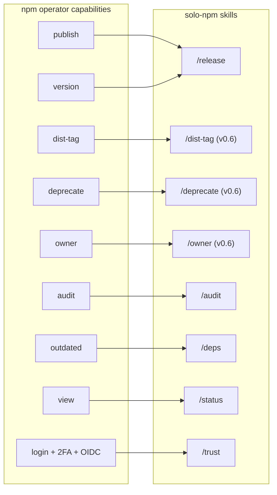

# npm operator capabilities — solo-npm coverage analysis

> Status: research deliverable. **v0.6.0 shipped**: `/dist-tag`, `/deprecate`, `/owner` skills landed; `/verify` extended with pkg-check; README reframed around the npm-operator-capability narrative.

## TL;DR (post v0.6.0)

- solo-npm now covers **all four real gaps** identified in this analysis: post-publish dist-tag mgmt, version deprecation, owner mgmt, manifest completeness validation.
- **`/solo-npm:verify` retained** as the only skill that's not strictly an npm-operator capability — it's a release-safety gate. Now explicitly classified as "safety + infrastructure" in the README's two-kinds-of-skills section.
- **README reframed**: opener is now *"AI skills for every npm operator capability a solo dev actually uses — plus the safety gates and infrastructure around them."* New "npm coverage" table maps each npm capability to its skill (or non-goal). New capability→skill diagram.

---

## 1. Inventory — what npm exposes

### 1.1 CLI commands (npm 10/11)

Grouped by functional category. ★ marks operations that a solo-dev publisher routinely performs.

#### Identity / authentication
- `npm adduser` / `npm login` — register or sign in to a registry account ★
- `npm logout` — drop the current registry credentials
- `npm whoami` — print the current registry username
- `npm token list/create/revoke` — manage personal access tokens (legacy + granular)
- `npm profile` — change registry profile settings (2FA, email, password)

#### Package state — local
- `npm init` — scaffold a new `package.json`
- `npm install` / `npm i` — add a dep + write to manifest + lockfile ★
- `npm ci` — clean install from lockfile (CI/automation) ★
- `npm uninstall` / `npm un` — remove a dep
- `npm update` — bump deps within their semver range ★
- `npm dedupe` — flatten the dep tree
- `npm prune` — remove extraneous deps
- `npm rebuild` — rebuild native bindings
- `npm shrinkwrap` — lock the dep tree for publication (legacy; lockfiles supersede)
- `npm pkg` — read/write fields in `package.json` from the CLI ★
- `npm version` — bump version + tag in git ★
- `npm pack` — produce a `.tgz` tarball without publishing
- `npm link` / `npm unlink` — symlink for local dev

#### Registry queries
- `npm view` (alias `npm info`) — read package metadata + dist-tags + versions ★
- `npm search` — search the registry
- `npm ls` (`npm ll`) — print the installed dep tree
- `npm outdated` — list deps with newer versions available ★
- `npm explain` — explain why a package is in the tree
- `npm query` — dependency-selector queries (npm 9+)
- `npm fund` — show funding URLs
- `npm bugs` / `npm docs` / `npm repo` — open the package's bugs/docs/repo URLs
- `npm ping` — health-check the registry
- `npm diff` — diff two versions of a package

#### Publishing + version management
- `npm publish` ★ — publish a tarball to the registry
- `npm unpublish` — remove a published version (24h hard window for popular packages)
- `npm dist-tag add/rm/ls` ★ — manage dist-tags (`@latest`, `@next`, `@v1`, etc.)
- `npm deprecate` ★ — mark a version (or range) as deprecated, with a message
- `npm access list/get/set` — read or change public/restricted access on scoped packages
- `npm sbom` (npm 10+) — generate a Software Bill of Materials
- `npm star` / `npm unstar` — favorite a package (social)
- `npm hook list/add/rm/update` — registry-side webhooks for package events

#### Organizations & teams
- `npm org create/rm/ls/set` — manage npm orgs (paid feature)
- `npm team create/rm/ls/add/rm` — manage org teams + memberships
- `npm owner add/rm/ls` ★ — manage maintainers on a package

#### Security
- `npm audit` — list known vulnerabilities ★
- `npm audit fix` — auto-apply non-breaking upgrades that resolve advisories ★
- `npm audit signatures` — verify package signatures (provenance + sigstore)

#### Diagnostics
- `npm doctor` — local-environment health check
- `npm config` — read/write npm config
- `npm cache verify/clean/ls` — manage the local cache
- `npm explore` / `npm edit` — inspect or edit installed packages
- `npm exec` — run a command from a package (one-off)

#### Lifecycle scripts (in `package.json#scripts`)
- `npm run-script` (`npm run`) — invoke any defined script ★
- `npm test` / `npm start` / `npm stop` / `npm restart` — convenience wrappers

### 1.2 Registry features (npmjs.com platform)

- **OIDC Trusted Publishing** (2025) — token-less CI publish via GitHub OIDC + a configured trust between the package and the GitHub workflow. ★
- **SLSA provenance attestations** — Sigstore-backed signed attestations linking a published tarball to the exact GitHub commit + workflow run that built it. Enabled via `npm publish --provenance=true`. ★
- **Dist-tags** — arbitrary string labels pointing at versions; default `latest`. Consumers install via `npm i pkg@<tag>`. ★
- **Scoped packages** — `@scope/name` namespacing; allows access control + organization grouping. ★
- **Access levels** — `public` or `restricted` (paid plan) for scoped packages.
- **Two-factor authentication** — `auth-only` (login) or `auth-and-writes` (login + publish). Web-based 2FA gate for trust config. ★
- **Granular access tokens** — package-scoped + permission-scoped tokens (npm 8.13+).
- **Automation tokens** — machine-readable tokens that bypass 2FA prompts for CI (legacy now that OIDC exists).
- **Security advisories** — GitHub Advisory Database integration; surfaced via `npm audit`. ★
- **Package deprecation** — soft retire; the version stays installable but emits a warning. ★
- **Package unpublishing** — 24-hour hard removal window for popular packages.
- **Owner management** — `npm owner add/rm` allows multiple maintainers per package.
- **Hooks** — registry-side webhooks for package events (publish, version, dist-tag changes).
- **Organizations + teams** — paid feature for team workflows.

---

## 2. Inventory — what solo-npm covers today

For each of the 9 skills, the npm CLI commands and registry features it actually orchestrates:

| solo-npm skill | npm CLI commands invoked | npm registry features touched | Lifecycle phase |
|---|---|---|---|
| `/solo-npm:init` | `npm pkg` (publishConfig), `npm-trust --doctor` | dist-tags (via release.yml three-layer detection); OIDC scaffold | Bootstrap |
| `/solo-npm:trust` | `npm login` (manual handoff), `npm-trust github` | OIDC Trusted Publishing config; web 2FA | Bootstrap |
| `/solo-npm:verify` | `npm run lint/typecheck/test/build` (or pnpm equivalent) | (none — local quality gates) | Per-release wrapper |
| `/solo-npm:release` | `npm version` (auto-bump), `git tag` triggers CI's `npm publish --provenance=true` | OIDC publish; provenance attestation; dist-tag detection (via release.yml) | Per-release |
| `/solo-npm:prerelease` | `npm version --no-git-tag-version`; CI's `npm publish --tag next` | dist-tag `@next`; provenance | Lifecycle transition |
| `/solo-npm:hotfix` | `npm version`, `npm pkg set publishConfig.tag`; CI's `npm publish --tag <X>` | dist-tag `@latest` or `@v<major>` | Lifecycle transition |
| `/solo-npm:status` | `npm view <pkg> --json` (incl. dist-tags); downloads API; `gh` queries | Registry read; dist-tags display | Operate |
| `/solo-npm:audit` | `pnpm audit` (or npm/yarn audit) | Security advisories | Operate |
| `/solo-npm:deps` | `npm outdated`, `pnpm install`/`pnpm update` | (none — local dep tree) | Operate |

**Observation**: 7 of the 9 skills directly orchestrate npm CLI commands. `/verify` is local-only quality gates (no npm CLI). `/init` is partially npm (publishConfig) + partially GitHub Actions infrastructure (release.yml).

---

## 3. Coverage matrix — npm capabilities → solo-npm

| npm capability | Coverage | Where | Priority of gap |
|---|---|---|---|
| `npm publish` | ✓ full | `/release` (via tag-triggered CI) | — |
| `npm version` | ✓ full | `/release`, `/prerelease`, `/hotfix` | — |
| `npm audit` | ✓ full | `/audit` | — |
| `npm audit fix` | ✓ via `/deps` chain | `/audit` → `/deps` | — |
| `npm outdated` | ✓ full | `/deps` | — |
| `npm install/update` | ✓ partial | `/deps` (upgrade-only; not initial-add) | — (initial-add is dev-time, out of scope) |
| `npm view` | ✓ full | `/status` | — |
| `npm whoami` / `npm login` | ✓ via `/trust` manual handoff | `/trust`, `/init` Phase 2 | — |
| OIDC Trusted Publishing | ✓ full | `/trust` (orchestrates `npm-trust github`) | — |
| Provenance attestation | ✓ full | `/release` (via release.yml's `--provenance=true`) | — |
| Dist-tag at publish time | ✓ full | release.yml three-layer detection | — |
| `npm dist-tag` post-publish (add/rm/ls) | ✓ shipped v0.6.0 | `/solo-npm:dist-tag` | — |
| `npm deprecate` | ✓ shipped v0.6.0 | `/solo-npm:deprecate` | — |
| `npm owner` add/rm/ls | ✓ shipped v0.6.0 | `/solo-npm:owner` | — |
| **`npm access` post-publish flip** | ✗ deferred non-goal | (manual `npm access set`) | LOW |
| `npm unpublish` | ✗ not covered | — | (deferred non-goal — 24h window, rarely safe) |
| `npm token` mgmt | ✗ not covered | — | (deferred — OIDC obviates for CI) |
| `npm 2FA` toggle | ✗ not covered | — | (deferred — once-per-account setup) |
| `npm hook` (webhooks) | ✗ not covered | — | (deferred non-goal — niche) |
| `npm org/team` | ✗ not covered | — | (deferred non-goal — not solo-dev) |
| `npm sbom` | ✗ not covered | — | LOW (compliance use case; defer) |
| `npm pkg` (manifest editor) | ✓ used internally | `/init`, `/release` | — |
| `npm pack` | ✗ not covered | — | (non-goal — dev-time inspection) |
| `npm search/star/fund` | ✗ not covered | — | (non-goal — non-release operations) |
| `npm doctor` (local env) | ✗ not covered | — | (non-goal — covered by `npm-trust --doctor` for trust state) |
| Pre-publish package.json completeness validation (README, LICENSE, exports, repository) | ✗ partial — `/init` scaffolds publishConfig but doesn't validate everything | — | MED |

---

## 4. Gaps — analysis depth

### 4.1 `/solo-npm:dist-tag` (HIGH priority)

**The gap**: dist-tags are managed only at *publish time* (release.yml's three-layer detection). After publish, there's no skill to:

- Remove a stale `@next` after promote (today: `/status` warns, but the user has to `npm dist-tag rm` manually).
- Add a `@canary` or `@experimental` tag to a specific version for opt-in testing.
- Repoint `@latest` after a botched release (e.g., publish 1.6.0 with a regression → manually `npm dist-tag add pkg@1.5.0 latest`).
- List all current dist-tags across a portfolio (today: `/status` shows `@latest` and `@next`; doesn't show others).
- Bulk operations: "remove `@experimental` from every package in my monorepo".

**Why it matters for solo-dev**:
- Solo devs don't have a CI on-call rotation; if a release goes wrong, fast `dist-tag` repointing is the recovery lever before consumers update.
- Pre-release flows (`/prerelease`) leave stale `@next` after PROMOTE; cleanup is manual.
- Channel proliferation (canary, beta, rc, experimental) is hard to manage by hand at portfolio scale.

**Proposed shape**:
```
/solo-npm:dist-tag
  Phase 0: prompt-context (which package, which tag, which version, add/rm/repoint)
  Phase A: pre-flight (clean tree not required — read-only registry mutation)
  Phase B: gate via AskUserQuestion with the proposed mutation diff
    - "Repoint @latest from 1.6.0 → 1.5.0 on @ncbijs/eutils"
    - "Remove stale @next on 8 packages (currently points at superseded 1.5.0-beta.3)"
    - "Add @canary → 1.6.0-experimental.2 on 3 packages"
  Phase C: execute via `npm dist-tag <add|rm>` per package, with auth from npm-trust's session or OIDC
  Phase D: verify + update .solo-npm/state.json (track current dist-tags in cache)
```

Composes naturally with `/status` (cleanup the stale-@next warning), `/release` (rollback after botched release), and `/prerelease` (post-PROMOTE cleanup).

### 4.2 `/solo-npm:deprecate` (HIGH priority)

**The gap**: there's no skill for retiring versions. When you need to:

- Tell users "v1.x is EOL — migrate to v2.0.0" (mass-deprecate `1.x` with a message pointing at v2).
- Mark a specific bad version as do-not-use (`npm deprecate pkg@1.6.0 "do not use — has data-corruption bug; upgrade to 1.6.1"`).
- Lift a deprecation later (set the message to `""` to undeprecate).
- Range-deprecate after a security disclosure.

Today: the user opens a terminal and runs `npm deprecate <pkg>@<range> "message"` manually for each package + version range. For monorepos, this is tedious.

**Why it matters**:
- Deprecation messages surface as `npm WARN` during install — visible to every consumer running `npm i`.
- It's the *gentle* alternative to unpublish (which has a 24h window and breaks consumers' lockfiles). Deprecation is reversible and preserves install-ability.
- Coordinated multi-package deprecation (e.g., "v1.x of every package in this monorepo is now EOL") is the natural counterpart to unified versioning.

**Proposed shape**:
```
/solo-npm:deprecate
  Phase 0: prompt-context (which packages, which range, message; or "undeprecate" intent)
  Phase A: pre-flight + state read (which versions exist; current deprecation status)
  Phase B: render plan + AskUserQuestion gate
    - "Deprecate @ncbijs/* versions <2.0.0 with message: 'v1.x is EOL — migrate to v2'"
    - List affected versions per package
  Phase C: execute via `npm deprecate <pkg>@<range> "<msg>"` per package
  Phase D: verify + cache the deprecation state in .solo-npm/state.json
```

Composes with `/release` (post-major release: chain to /deprecate to retire previous major), with `/audit` (CVE response: deprecate the affected version range), and with `/hotfix` (after shipping v1.5.5 hotfix on a deprecated line, the existing deprecation message remains valid).

### 4.3 `/solo-npm:owner` (MED priority)

**The gap**: solo-dev rarely needs this, but when they do, there's no skill.

Use cases:
- Adding a backup maintainer for the bus-factor problem.
- Transferring ownership when handing off a package.
- Adding a publish-only automation bot account (rare with OIDC).
- Removing a co-maintainer who's left the project.

**Why MED instead of HIGH**: it happens once or twice in a package's lifetime. Manual `npm owner add/rm` is tolerable. But for portfolios, "add @backup-maintainer to all 43 packages" is tedious — that's where a skill earns its keep.

**Proposed shape** (lightweight):
```
/solo-npm:owner
  - "List owners across portfolio"
  - "Add <username> to all packages (or filtered subset)"
  - "Remove <username> from all packages"
  - One AskUserQuestion gate per mutation
```

### 4.4 `/solo-npm:access` flip (LOW priority)

**The gap**: `/init` sets initial access (public/restricted) via publishConfig. There's no skill for flipping post-publish.

Use cases:
- Open-sourcing a previously-private package (`npm access set status=public`).
- Locking down a package after a paid-tier transition.

**Why LOW**: solo-dev rarely changes a package's access. When they do, it's a deliberate one-off — manual `npm access set` is fine.

### 4.5 Pre-publish package.json completeness (MED priority)

**The gap**: `/init` scaffolds publishConfig and engines.node but doesn't validate completeness. Missing fields that consumers expect:

- `description` — used in registry search results
- `keywords` — discoverability
- `license` (and a `LICENSE` file)
- `repository` — links back to source
- `homepage` — landing page
- `bugs` — issue tracker URL
- `exports` (modern) or `main` (legacy) — entry points
- `files` (allowlist) — what gets included in the tarball
- `README.md` exists and is non-empty

These are checked by various lints (npm-package-json-lint, publint) but no solo-npm skill bundles them.

**Proposed shape**: extend `/verify` (or add `/lint`?) to include a `pkg-completeness` check. Surface missing fields with `AskUserQuestion` to fix or skip.

Tighter scope: **bake the validation into `/init`'s pre-flight + `/release` Phase A**. If publish-critical fields are missing, surface as a STOP (with auto-fix offer for trivial ones like `repository` derivable from `git remote`).

---

## 5. Where solo-npm goes BEYOND npm-operator role (intentional)

These aren't gaps — they're solo-npm doing more than just orchestrating npm:

- **`/verify`** — local quality gates (lint + typecheck + test + build). Not an npm operation; it's the *safety wrapper* around npm operations. Composes with `/release`, `/prerelease`, `/hotfix`, `/deps`.
- **`/init`'s release.yml scaffolding** — a GitHub Actions workflow file. That's CI/CD infrastructure, not npm. solo-npm scaffolds it because the publish step lives there.
- **`/init`'s consumer wrappers** (`.claude/skills/release/SKILL.md`) — Claude Code plugin pattern, not npm.
- **`.solo-npm/state.json` cache** — solo-npm-specific state, not npm.
- **`/status`'s GitHub `gh` queries** — issues, CI runs. Surfaces npm metadata alongside, but `gh` is GitHub.

These are intentional additions because *the publishing flow as a whole* spans more than just npm. But the README framing should distinguish them from npm-operator skills proper.

---

## 6. Proposed framing alignment

### 6.1 Repositioning statement

**Current README opener**: *"The full npm publishing lifecycle for AI-driven solo developers."*

**Proposed**: *"AI skills for every npm operator capability a solo dev actually uses — plus the safety gates and infrastructure around them."*

The new opener:
- Foregrounds the npm-operator framing (responding to: "we should build skills around npm capabilities").
- Acknowledges the safety/infrastructure layer ("plus the safety gates and infrastructure") rather than pretending /verify and release.yml scaffolding are npm.
- Solo-dev framing remains.

### 6.2 README structural change

Add a new top-level section **"npm coverage"** between "The nine commands at a glance" and "Tell Claude". Single table:

| npm operator capability | Skill | Status |
|---|---|---|
| `npm publish` (with provenance + OIDC) | `/release` | ✓ |
| `npm version` (auto-bump from commits) | `/release` | ✓ |
| `npm dist-tag` at publish time | release.yml three-layer detection (auto) | ✓ |
| `npm dist-tag` post-publish (cleanup, repoint, channels) | `/dist-tag` | planned v0.6.0 |
| `npm audit` (with risk classification) | `/audit` | ✓ |
| `npm audit fix` (chained) | `/audit` → `/deps` | ✓ |
| `npm outdated` + dep upgrades | `/deps` | ✓ |
| `npm view` (portfolio dashboard) | `/status` | ✓ |
| `npm login` + 2FA + OIDC trust config | `/trust` | ✓ |
| `npm deprecate` (mass + reversible) | `/deprecate` | planned v0.6.0 |
| `npm owner` add/rm/ls | `/owner` | planned v0.6.0 |
| `npm access` set post-publish | (manual `npm access set`) | non-goal — rare |
| `npm unpublish` | (manual `npm unpublish`) | non-goal — 24h window, rarely safe |
| `npm token` mgmt | (manual `npm token`) | non-goal — OIDC obviates |
| `npm hook`, `npm org`, `npm team` | (manual) | non-goal — not solo-dev |

This table makes the philosophy explicit AND honest about what's missing.

### 6.3 Add a new diagram: "npm capability → skill"

Replace or supplement the lifecycle diagram with a capability-axis view. Something like:



This complements the lifecycle diagram. Lifecycle = "when do I use which skill?". Capability = "which npm operation does this skill orchestrate?".

### 6.4 Distinguish "operator skills" from "safety + infrastructure"

In the "Architecture" section, add a clear paragraph:

> **Two kinds of skills.** solo-npm has **operator skills** (`/release`, `/audit`, `/deps`, `/status`, `/trust`, `/dist-tag` v0.6, `/deprecate` v0.6, `/owner` v0.6) which orchestrate npm CLI commands and registry features. It also has **safety + infrastructure skills** (`/init`, `/verify`) which scaffold the release-flow plumbing and gate operator skills with quality checks. The lifecycle/transition skills (`/prerelease`, `/hotfix`) span both — they orchestrate npm operations within a controlled branching workflow.

This is honest framing. It tells the LLM agent *and* the human reader exactly what each skill is for.

---

## 7. v0.6.0 — shipped

All Tier 1 + Tier 2 items from the original ranking landed in v0.6.0.

### Shipped (Tier 1 + 2)

1. ✓ **`/solo-npm:dist-tag`** — manage post-publish dist-tags (add/rm/ls/repoint/cleanup-stale). Composes with `/status` (acts on stale-@next warnings) and `/prerelease` PROMOTE (optional cleanup chain).

2. ✓ **`/solo-npm:deprecate`** — mark versions deprecated (range-aware, mass + reversible). Composes with `/release` Phase G post-major and `/audit` Phase 5 (CVE response option).

3. ✓ **`/verify` Step 5: pkg-check** — `package.json` + LICENSE + README completeness validation with auto-fix offers (repository.url from git remote, MIT scaffold, README stub). Severity by context (warnings standalone, errors pre-release).

4. ✓ **`/solo-npm:owner`** — bulk maintainer management (add/rm/ls). Bus-factor mitigation for solo-dev portfolios.

### Deferred / non-goals (codified in README)

- `/solo-npm:access` flip — rare; manual `npm access set` is fine.
- `npm sbom` integration — niche compliance.
- `npm unpublish`, `npm token`, `npm hook`, `npm org`, `npm pack`, `npm search`, `npm star`, `npm fund` — non-goals per the README's "Out of scope (deliberate)" section.

---

## 8. Migration plan (if user agrees)

If the user approves a v0.6.0 with Tier 1:

1. Bump v0.5.5 → v0.6.0 in package.json + plugin.json.
2. Add `/solo-npm:dist-tag` (10th skill) and `/solo-npm:deprecate` (11th skill) to `.claude/commands/`.
3. Update lifecycle diagram to include the two new skills (under OPERATE — continuous lane).
4. Add the **npm coverage** table to README (per §6.2).
5. Add the **capability → skill** diagram (per §6.3).
6. Update "The nine commands" → "The eleven commands" (sorry).
7. Update plugin.json description to mention the 11 commands.
8. Add CHANGELOG v0.6.0 entry.
9. Update `/release` and `/audit` to optionally chain into `/deprecate` after major releases or critical CVEs.

If user disagrees: leave at 9 skills, just update the README framing per §6.1, §6.2, §6.4. Keep the analysis as a future-reference doc.

---

## 9. Honest caveats

- This analysis is a snapshot at npm 11 (early 2026). npm continues to evolve (sbom command landed in npm 10, granular tokens landed in npm 8.13, OIDC Trusted Publishing is fresh). v0.7.0+ should re-run this exercise.
- The "non-goal" classifications reflect *solo-dev priors*. A team-of-N maintainer would value `npm org/team` and `npm token` mgmt highly. solo-npm's positioning is solo-dev; if that ever expands, the non-goals reopen.
- Some "gaps" are arguably better solved by simply documenting the manual command. `/owner` is borderline — adding a skill for an operation that fires once a year may not earn its skill-file weight. The Tier 2 placement reflects this ambivalence.
